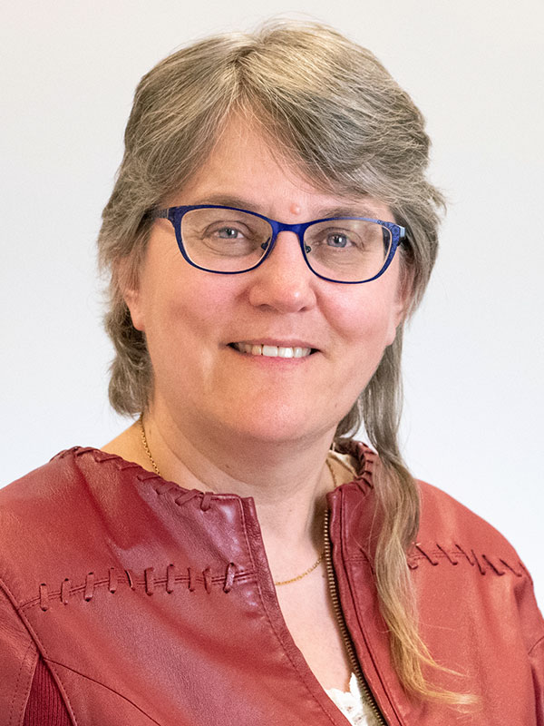

## Workshop Keynote

Dr. Fels has a PhD (1994) in Human Factors from Industrial Engineering at the University of Toronto. She is currently employed as a professor in the Ted Rogers School of Information Technology Management, and the Director of the Inclusive Media and Design Centre at Toronto Metropolitan University. Her research interests involve inclusive design, access to media and technology for people with disabilities and older adults, and inclusive business. She has published over 160 articles on inclusive technologies and applications, and received three patents.